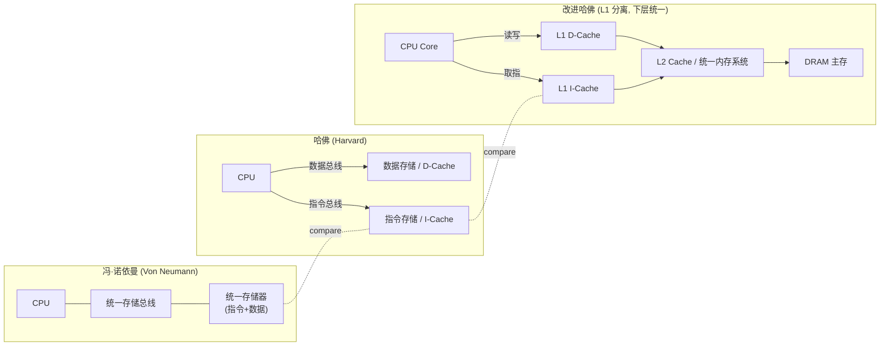

# Day 1

## 1) Linux 是宏内核还是微内核？
**Linux 是“宏内核（Monolithic）+ 可加载模块（LKM）”。**
- **宏内核**：调度、内存管理、文件系统、驱动等大部分服务都在内核态，彼此可直接调用；通过 **LKM** 动态装/卸驱动与子系统。
- **微内核**：仅保留最小内核（调度/内存/IPC），文件系统与驱动等放到**用户态服务**，靠消息传递通信（如 Mach、MINIX）。

## 2) 用户态（user mode）与内核态（kernel mode）含义
- **用户态（ring3）**：普通进程运行区域，**受限指令**，不能直接访问硬件与内核地址空间。
- **内核态（ring0）**：操作系统核心代码运行区域，**特权指令**与全部内存/设备可达。
- **为何区分**：保护系统稳定与安全，防止应用破坏内核或他人进程。
- **进入/返回路径**：
  1. **系统调用** 进入内核完成服务；
  2. **中断/异常**（设备中断、缺页等）→ 进入内核处理；
  3. 处理完毕 → **返回用户态**。


  
- ## 3) 用户进程间通信（IPC）主要方式
**同一台机器：**
- **匿名管道 `pipe`**：亲缘进程、**单向字节流**，轻量。
- **命名管道 FIFO**：通过路径使用，无亲缘关系也可通信。
- **消息队列**：**离散消息**，支持优先级。
- **共享内存**：**最高性能**，大块数据零拷贝共享；需配合同步原语（**信号量/互斥量/futex**）。
- **信号 `signal`**：异步通知（如 `SIGINT`、`SIGCHLD`），不适合传大量数据。
- **Unix 域套接字（AF_UNIX）**：**通用、双向**，可**传文件描述符**；数据库/守护进程常用。
- **事件/通知**：`eventfd`、`inotify`、`signalfd`（辅助机制）。
- **I/O 复用**：`select` / `poll` / `epoll`（不是 IPC，本质是事件等待/多路复用）。

**跨主机：**
- **TCP/UDP 套接字（AF_INET/AF_INET6）**：网络通信标准方案。

# Day 2：ARM 架构
## 1) NAND Flash 与 NOR Flash 的区别
| 项目 | NOR Flash | NAND Flash |
|---|---|---|
| 访问方式 | 随机读取速度快，可**直接按地址读**；支持 **XIP**（就地执行） | 页/块为单位的顺序访问，**不支持 XIP** |
| 典型时延 | 首次读延迟小、随机读快 | 连续读/写吞吐高 |
| 容量/成本 | 容量较小、**成本高** | **大容量、成本低** |
| 擦写粒度 | 块（一般 64–256 KB），写前需擦 | 块（一般 128 KB–数 MB）；**坏块管理** |
| 可靠性 | 位错误率低，ECC 需求弱 | 位错误率高，**强 ECC + 磨损均衡** 必须 |
| 接口 | 并行/串行（SPI NOR 常见） | 并行/ONFI，eMMC/UFS/SSD 属于 NAND 生态 |
| 典型用途 | **Boot 代码/固件**（可 XIP）、小容量配置 | **数据存储**（大文件、日志、FS），手机、SSD |

## 2) CPU / MCU / SoC 的区别
- **CPU（Central Processing Unit）**：处理器内核本体；通常**不包含**外设与存储（需外接内存/芯片组）。例：x86 CPU。
- **MCU（Microcontroller Unit）**：**CPU + 片上闪存/ SRAM + 外设**（GPIO/ADC/定时器/UART/SPI/I2C 等），面向**单片机**控制，低功耗、成本低。例：STM32、Cortex-M。
- **SoC（System on Chip）**：把 **CPU/GPU/多媒体/ISP/内存控制器/通信** 等系统级模块集成到一颗芯片；可运行 Linux/Android。例：Cortex-A 系列手机芯片、树莓派


## 3) 什么是交叉编译（Cross-Compilation）
在**宿主机（host）**上使用面向**目标机（target）**的编译器，生成能在目标架构/系统上运行的可执行文件或库。  
- 典型三元组（*target triple*）：`aarch64-linux-gnu-`, `arm-linux-gnueabihf-`, `arm-none-eabi-`  
  - `aarch64-linux-gnu-gcc` → 目标是 **AArch64 + Linux**  
  - `arm-linux-gnueabihf-gcc` → 目标是 **ARM 32-bit + Linux + 硬浮点**  
  - `arm-none-eabi-gcc` → 目标是 **裸机/RTOS（无操作系统 ABI）**，常用于 MCU
- 三角色概念：  
  - **build**：编译器自身运行的机器；  
  - **host**：生成的工具（如编译器二进制）将要运行的机器；  
  - **target**：**被编译的产物**将在其上运行的机器（对编译器而言）。


## 4) 冯·诺依曼结构 与 哈佛结构
- **冯·诺依曼（Von Neumann）**：**指令与数据共用同一存储与总线**。实现简单，但可能出现**指令/数据争用**）。
- **哈佛（Harvard）**：**指令存储与数据存储分离，分别有独立总线**，可并行访问，吞吐更高。
- **现代“改进哈佛”**：**统一虚拟地址空间**，但在**缓存/总线**层面分离 
  - **Cortex-A**：典型“改进哈佛”（分离的 I/D cache、统一编程模型）。  
  - **Cortex-M**：更接近哈佛（独立的取指与数据通道、可能带 TCM）。
 
  



  ## 5) ARM 有哪些“异常等级”（Exception Levels, EL）
**针对 ARMv8-A（A-profile, 64-bit/32-bit 应用处理器）**：
- **EL0（User）**：用户态应用程序。  
- **EL1（Kernel/OS）**：操作系统内核（如 Linux）。  
- **EL2（Hypervisor）**：虚拟化管理层（如 KVM/Hyper-V 的 hypervisor 部分）。  
- **EL3（Secure Monitor）**：安全监控器/固件，**TrustZone** 的切换点

 ```mermaid
flowchart TB
  %% nodes
  EL3["EL3: Secure Monitor / TrustZone"]

  subgraph N ["Normal World (NS)"]
    EL2N["EL2: Hypervisor"]
    EL1N["EL1: Kernel/OS"]
    EL0N["EL0: Apps"]
  end

  subgraph S ["Secure World (S)"]
    EL1S["EL1: Trusted OS (TEE)"]
    EL0S["EL0: TEE Apps"]
  end

  %% edges (use ASCII only in labels)
  EL0N -->|SVC| EL1N
  EL1N -->|HVC| EL2N
  EL0N -->|SMC| EL3
  EL1N -->|SMC| EL3
  EL2N -->|SMC| EL3

  EL0S --> EL1S
  EL1S -->|SMC return| EL3

  EL3 <--> |World Switch| N
  EL3 <--> |World Switch| S
```
